# Exercise Set 1 #
# Kostas Mathioudakis CSD3982 #

## Exercise 1 ##
### (a) ### 
docker pull nginx:1.23.3  
docker pull nginx:1.23.3-alpine  
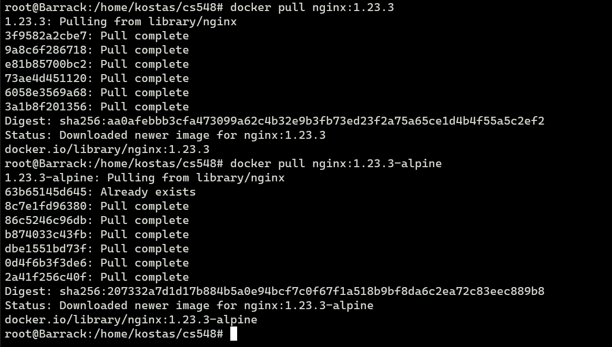

### (b) ###  
docker image ls
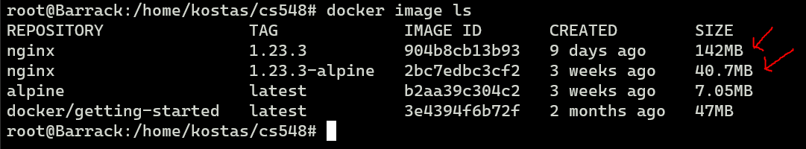

### (c) ### 
docker run -d -p 80:80 nginx:1.23.3-alpine
curl http://localhost
#### The answer of curl is the html file being hosted by the container in the localhost ####  
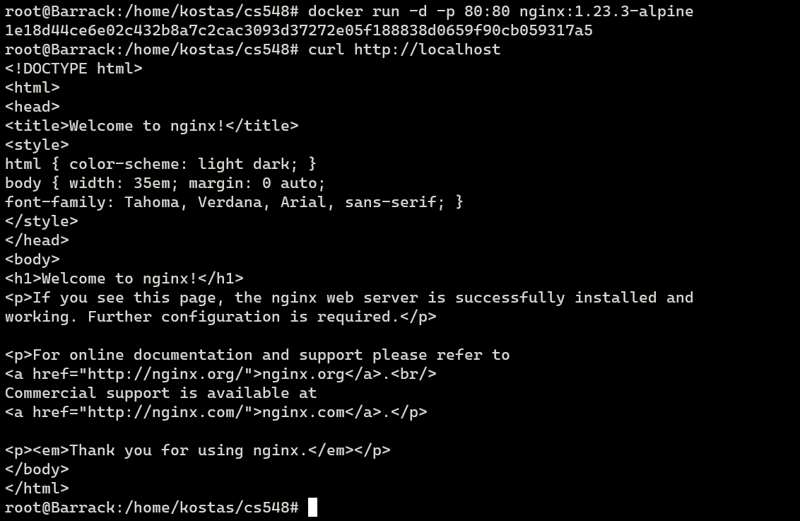

### (d) ###
docker ps
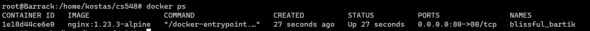

### (e) ###
docker logs (id)

### (f) ###
docker stop (id)
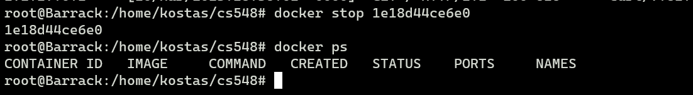

### (g) ###
docker ps -a  
docker start (id)  
docker ps  
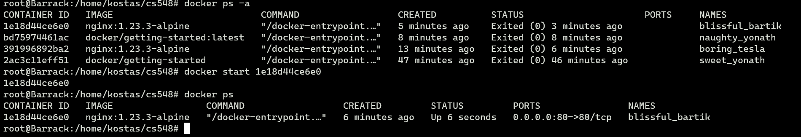

### (h) ###
docker ps  
docker stop (id)  
docker rm (id)  
docker ps -a  
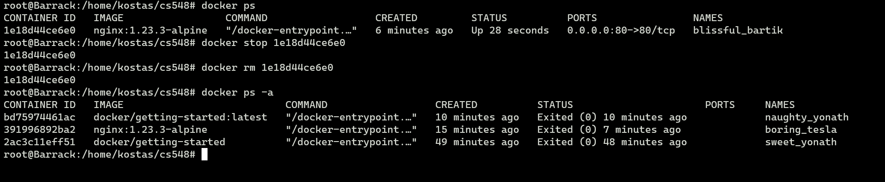

## Exercise 2 ##
### (a) ###  
docker run -d -p 80:80 --name my-nginx nginx:1.23.3-alpine  
docker exec -it my-nginx /bin/sh  
cd /usr/share/nginx/html  
cat index.html  
#### We ran the container with port forwarding to forward it on our machine. Then we opened a shell session in it and changed the contexts of 'index.html' in the '/usr/share/nginx/html' location and added "MY" to where we had to.  Below is a screenshot from the local machine where we curl and see the changes, and below that is another screenshot from the browser  ####
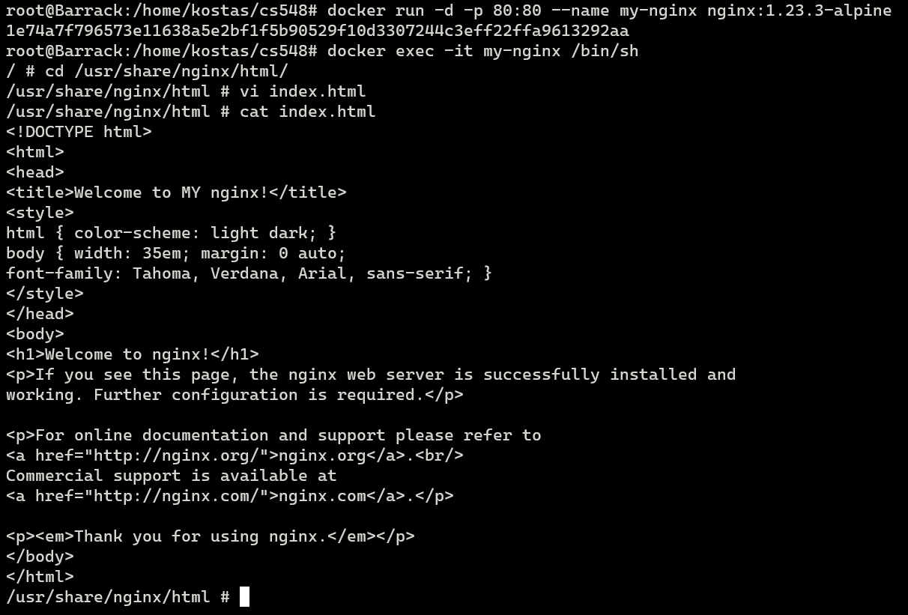

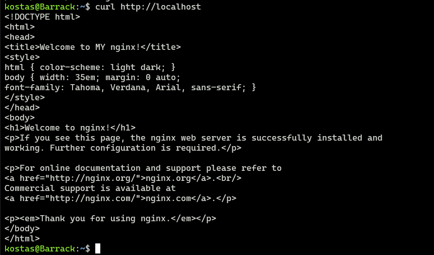

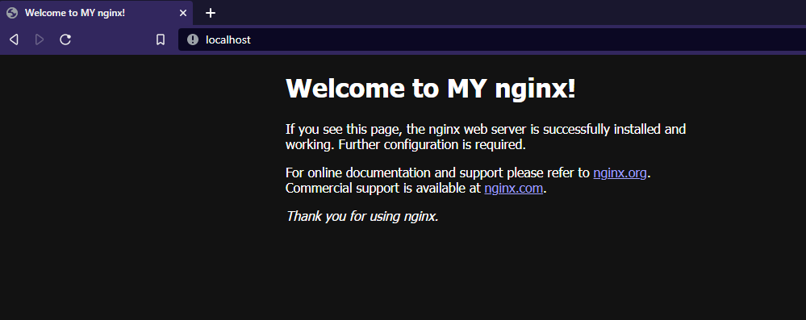

### (b) ###  
docker cp my-nginx://usr//share//nginx//html//index.html index.html
ls && cat index.html  
#### We use the docker cp command to copy stuff in and out of the container then i just used the 'cat' command to output the file after i copied it on the local machine. ####
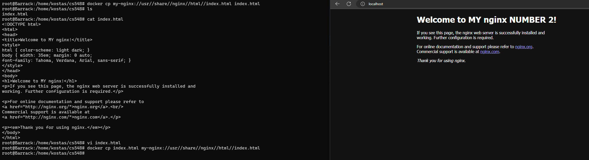

### (c) ###
docker stop my-nginx  
docker rm my-nginx  
docker run -d -p 80:80 --name my-nginx nginx:1.23.3-alpine
#### We can see that now the page is not changed. That is of course normal because the changes we did on it before were inside the container which we later removed so now the changes are lost. The page we loaded now is from the new container we pulled from docker hub and it has the default html text it ships with. ####

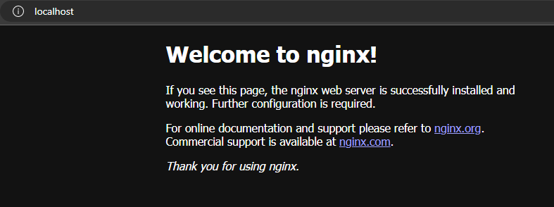

## Exercise 3 ##
1. `1_installing_hugo.PNG`: cp /mnt/c/....../hugo.deb ./   
    sudo dpkg -i ./hugo.deb 
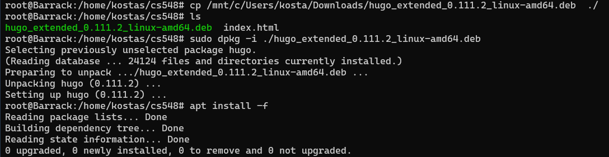

2. `2_git_stuff.PNG`: git clone https://github.com/KostasMathioudakis/hy548.git  
cd hy548  
git submodule init  
dit submodule update  
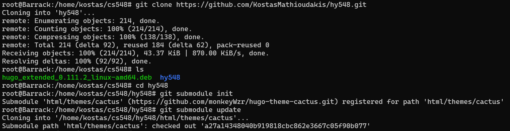

3. `3_make.PNG`: make
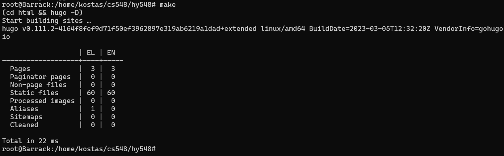

4. `4_container.PNG`: docker run -d -p 80:80 --name hugo nginx:1.23.3
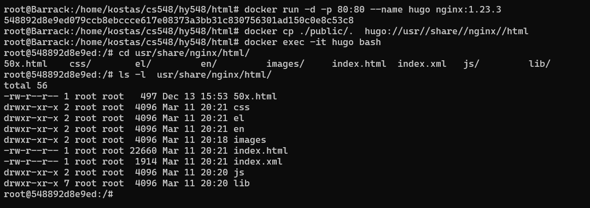

5. `5_localhost.PNG`: It works !!!
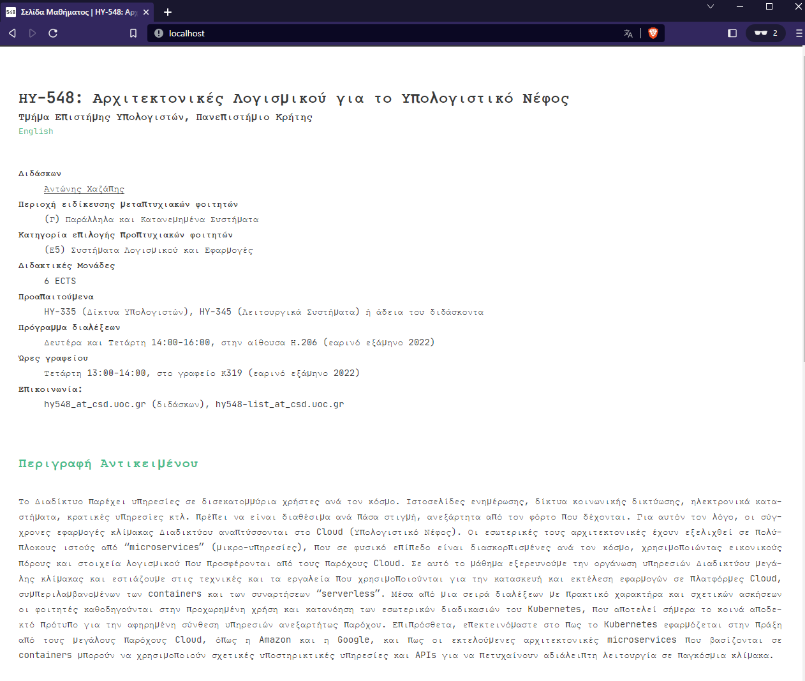
