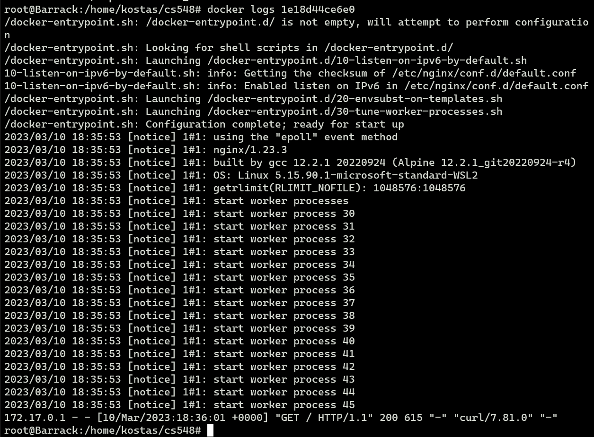

# Exercise 1 #
# Kostas Mathioudakis CSD3982 #

## Exercise 1 ##
### (a) ### 
docker pull nginx:1.23.3  
docker pull nginx:1.23.3-alpine  

### (b) ###  
docker image ls

### (c) ### 
docker run -d -p 80:80 nginx:1.23.3-alpine
curl http://localhost
#### The answer of curl is the html file being hosted by the container in the localhost ####  

### (d) ###
docker ps

### (e) ###
docker logs (id)

### (f) ###
docker stop (id)

### (g) ###
docker ps -a  
docker start (id)  
docker ps  

### (h) ###
docker ps  
docker stop (id)  
docker rm (id)  
docker ps -a  

## Exercise 2 ##
### a ###

### a2 ###

### a3 ###

### b ###

### c1 ###

### c2 ###

