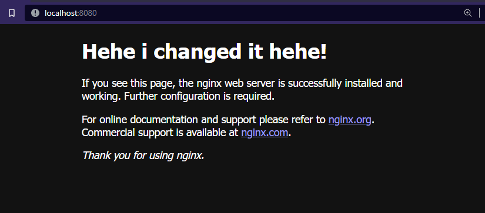
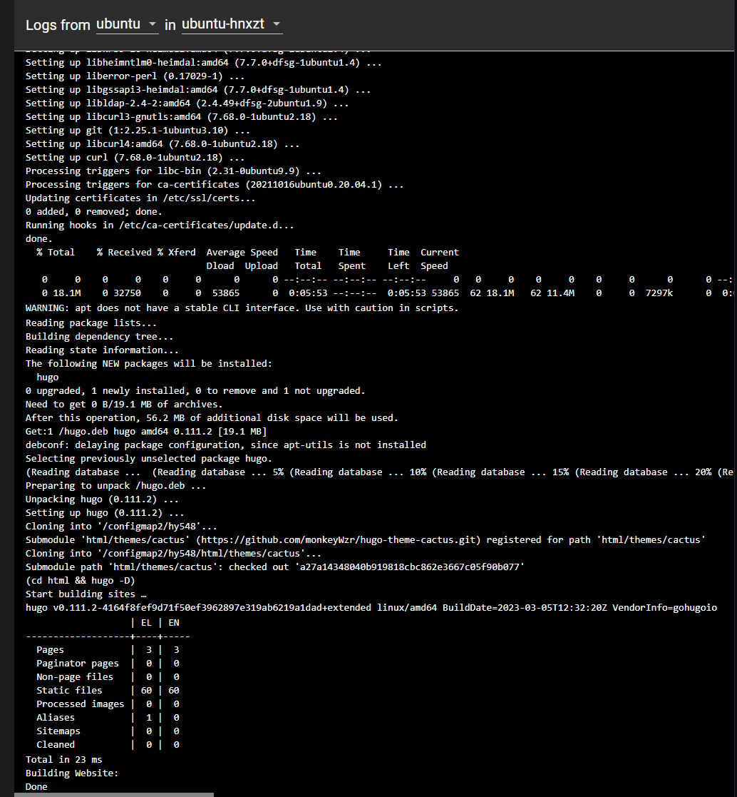

# Kostas Mathioudakis CSD3982
# Exercise set: 2

## Exercise 1

### a)
Here is the yaml file:

`/1/1_nging_yaml`


```bash
 $ minikube start
```
 This command is used to autoconfigure a minikube cluster.


```bash
 $ kubectl apply -f .\1_nginx.yaml  
```
This command is for applying the manifest on Kubernetes and starting the pod. 


### b) 
```bash
 $ kubectl port-forward nginx-pod 8080:80   
```
This command is for port forwarding the pod's port 80 to my local 8080.  


Then i can open my browser and go to localhost:8080 to see if it's working.  


### c)

```bash
 $ kubectl logs nginx-pod  
```

To see the logs of the nginx-pod.  


### d)

```bash
 $ kubectl exec -it nginx-pod -- /bin/sh  
 $ cd /usr/share/nginx/html  
 $ vi index.html  
```

Start a session inside the nginx-pod and  
make necessary changes in the .html file 


Checking the browser to see if the change is showing up:  


### e)

To download default page:  
```bash
 $ curl http://localhost:8080 -o default.html  
```

or 

```bash 
 $ kubectl cp nginx-pod:usr/share/nginx/html/index.html .\default.html
```

In the screenshot i ve provided i 've done the curl method because of less typing
and because i can and it's easy. 


```bash 
 $ kubectl cp .\new.html nginx-pod:usr/share/nginx/html/index.html  
```
Using kubectl cp to change the page to the 'new.html' file.


Checking if the changes were made by opening localhost on browser:



```bash
 $ kubectl delete -f 1_nginx.yaml
```
### f)

To remove the manifest and delete the pod.


## Exercise 2

Here is the code in the yaml file:
`/2/2_build_website.yaml`

These are two config maps, one is for installing the dependancies and updating using the synaptic package manager.

The second one is for downloading the website from github installing hugo and setting up the submodules and building the site.


Then the job.


To confirm that the job completeled successfully i could either run:
```bash
 $ minikube dashboard
```
and look at minikube's dashboard to see if the job was completed or i could simply use :
```bash
 $ kubectl get jobs
```
I can also check the logs for the pod:

```bash
 $ kubectl logs <pod-name>
```

## Exercise 3
Here is the yaml file:

`/3/3_build_and_update.yaml`

PersistentVolumeClaim (PVC): A PVC named pvc is created to provide persistent storage for the website's files. This allows data to be shared between different Kubernetes resources, such as Jobs, CronJobs, and Pods.


ConfigMap: A ConfigMap named scripts is created to store the `build_website.sh` and `update.sh` scripts. These scripts are responsible for building the website and updating it if changes are detected in the git repository.


Job: A Job named ubuntu is created to run the `build_website.sh` script. This script clones the repository, builds the website using Hugo, and stores the generated HTML files in the html directory within the PVC.


nginx Pod: A Pod named nginx is created to run the Nginx web server. The PVC is mounted at `/usr/share/nginx`, allowing the web server to serve the HTML files generated by the Job. The Nginx server listens on port 80 to serve the web pages.


CronJob: A CronJob named job-repeating is scheduled to run the `update.sh` script every night at 2:15.(In the screenshot it's every 3 minutes because i was testing it...) The script checks for changes in the git repository, and if changes are detected, it updates the website and copies the new files to the html directory within the PVC.


Data communication between containers:

The primary method of data communication between containers in this solution is through the PVC. The PVC acts as shared storage for the website's files, enabling the Job, CronJob, and Pod to access and manipulate the same data. The Job and CronJob write the generated HTML files to the PVC, while the Nginx Pod reads these files to serve the web pages.

Additionally, the ConfigMap is used to share the build_website.sh and update.sh scripts between the Job and CronJob. The scripts are mounted as volumes into the respective containers, allowing them to execute the scripts.

### Is it working though? 


### Here is the test drive:

```bash
kubectl apply -f .\3_build_and_update.yaml
```


Then i am opening the minikube dashboard to check the logs.

First things first the `ubuntu` job logs:


Then port forward the nginx pod:


and then i will open `localhost:8080` on my browser and see if it's working while keeping the nginx pod logs open on the other window to see if the `GET` requests have any errors.


Last but not least i checked that the cronjob runs as it should every 3 minutes:


## Exercise 4