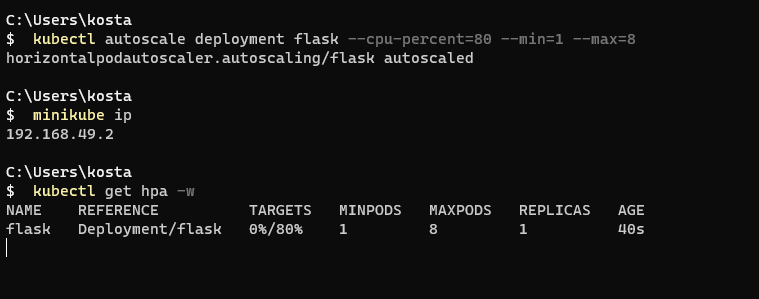

# Kostas Mathioudakis CSD3982
# Exercise set: 3

***

## Exercise 1

### (a)

First editing the `/1/flask-hello/hello.py` file so it returns the os variable.


To build we run:

```bash
$   docker build -t flask -f Dockerfile . 
```


Then push to dockerhub assigning to it the tag:flask

```bash
$   docker tag flask:latest kostasmathioudakis/hw3
$   docker push kostasmathioudakis/hw3
```


And it is now pushed in dockerhub:


### (b)

I created the two files `/1/first.yaml` and `/2/second.yaml`.
I edited them accordingly:
- Changed paths so they point to /first and /second 
- Added the FIRST_MESSAGE and SECOND_MESSAGE for the service on each one

Then we start the yaml files amd open a minikube tunnel which is 
used to expose services to external traffic from outside the kubernetes cluster
and check if they are both running.

### (c)

```bash
$   minikube start
$   minikube addons enable ingress
$   kubectl apply -f first.yaml
$   kubectl apply -f second.yaml
$   minikube tunnel
```


Opened a second terminal to run curl.
The curl command needs the flag `-UseBasicParsing` in Windows 10.

```bash
$   curl -UseBasicParsing http://127.0.0.1/first
$   curl -UseBasicParsing http://127.0.0.1/second
```


***

## Exercise 2

I am going to use the locust that is already available in github at cs548 git.
It is located at `./2/locust.yaml`.

```bash
$   minikube start
$   minikube addons enable metrics-server 
$   minikube addons enable ingress
$   kubectl apply -f first.yaml
$   kubectl apply -f locust.yaml
$   minikube tunnel
```


Then i opened another terminal and ran these:

```bash
$   kubectl autoscale deployment flask --cpu-percent=80 --min=1 --max=8
$   minikube ip
$   get hpa -w
```



On a third terminal i only ran the minikube dashboard to have it open.

On the next screenshot i show what tools i used.
Unfortunately i wasnt fast enough to capture the exact moment but i remember it.
Users 1 pod could handle was 100 and the requests 253.
After that the second pod was started from the autoscaler.

sidenote: ignore the failures at the left i did reset it after i had put in the wrong ip.


As we can see here the autoscaler started another one.
We can also notice how this happened a bit after locust started sending more requests (first chart on locust).
Then the 4th one got started and this resulted in better response times.


And the scaling of the `first` service stops at 5 replicas.
We can also see how the target of 80% has been reached. 
I ve let it ran for about 5more minutes after that to make sure:


***

## Exercise 3

To remove the ingress addon on minikube:

```bash
$   minikube addons disable ingress
```

I installed helm using the winget package manager (Microsoft's Windows package manager)

```bash
$   winget install Helm.Helm
```

Then i set up the helm depo and updated helm:

```bash
$   helm repo add ingress-nginx https://kubernetes.github.io/ingress-nginx
$   helm repo update
```


Then installed the Ingress-Nginx controller using the Helm chart:

```bash
$   helm install ingress-nginx ingress-nginx/ingress-nginx
```


After installing the Ingress-Nginx controller I need to modify the services from the previous exercises so they use the according specs.
The new modified files are:

`./3/first.yaml`

`./3/second.yaml`


Do a kubectl apply and initiate the minikube tunnel:

```bash
$   kubectl apply -f first.yaml
$   kubectl apply -f locust.yaml
$   minikube tunnel
```

Check the minikube dashboard:

```bash
$   minikube dashboard
```


Run curl to make sure they are responding:

```bash
$   curl -UseBasicParsing http://127.0.0.1/first
$   curl -UseBasicParsing http://127.0.0.1/second
```


***

## Exercise 4

Navigate inside folder `./4` and create the helm chart with:

```bash
$   helm create hw3
```

Then:

Edit the contents of `values.yaml` file:
 
 - Add the image and the tag

 

 - Enable ingress
 - Set nginx as classname
 - Add annotations
 - Set path to the endpoint `/third`
 - Set resources limits
 - Enable the autoscaler 
 - Add the message


 - Then add the environment variable in the `/templates/deployment.yaml`


 - Then change the target port of `/templates/service.yaml`

 

 - Then edit the `/templates/ingress.yaml`

 

Then i ran helm install to install my chart
PS: i needed to downgrade the kubernetes version on my minikube so i had to reinstall ingress too.

```bash
$   helm install ingress-nginx ingress-nginx/ingress-nginx
```

```bash
$   helm install third .\hw3 --values .\hw3\ask03\4
```

Here is it working now:


I opened the minikube dashboard to check everything looks okay:


