# Kostas Mathioudakis CSD3982
# Exercise set: 3

***

## Exercise 1

First start minikube withe `kubernetes-version=1.22.4` :

```bash
$   minikube start --kubernetes-version=1.22.4
```


### (a) Create a crd:

```bash
$   kubectl apply -f fruit-crd.yaml
```

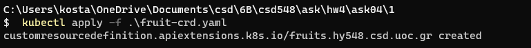

### b) Create the `fruit` instance:

```bash
$   kubectl apply -f fruit.yaml
```

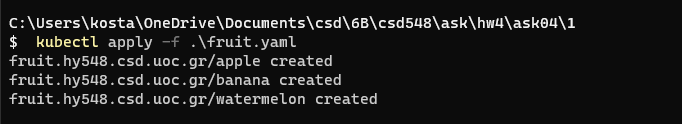

### c) Return the new instance in Yaml Format:

```bash
$   kubectl get apple -o yaml
```

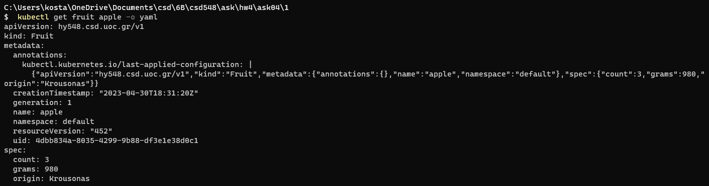

### d) Return a list of all available instances:

```bash
$   kubectl get fruits
```

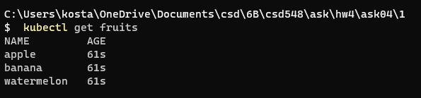

***

## Exercise 2

### a)

The dockerfile located at `./2/Dockerfile`:

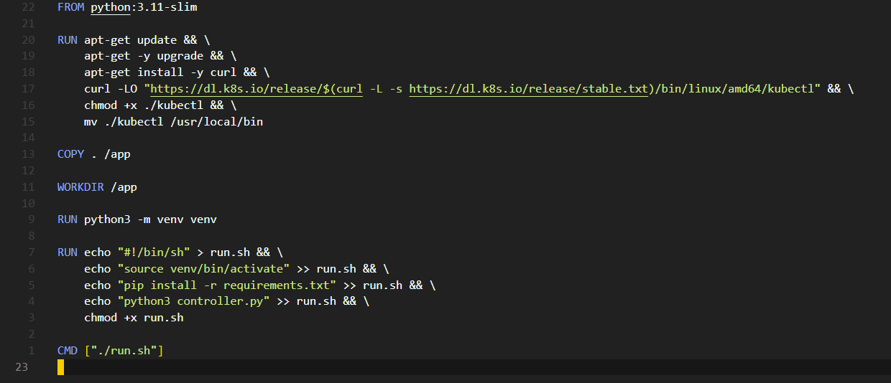

Commands used to build and upload/push to dockerhub:

```bash
    $  docker build -t hw4-2:latest -f Dockerfile .
    $  docker image tag hw4-2:latest kostasmathioudakis/hw4-2
    $  docker push kostasmathioudakis/hw4-2
```

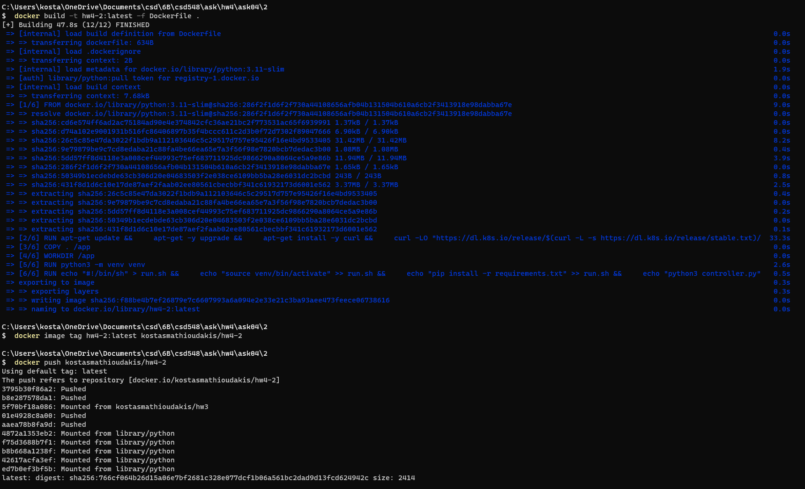

### b)

The deployment file is at `./2/exercise-4-task-2-deployment.yaml`:

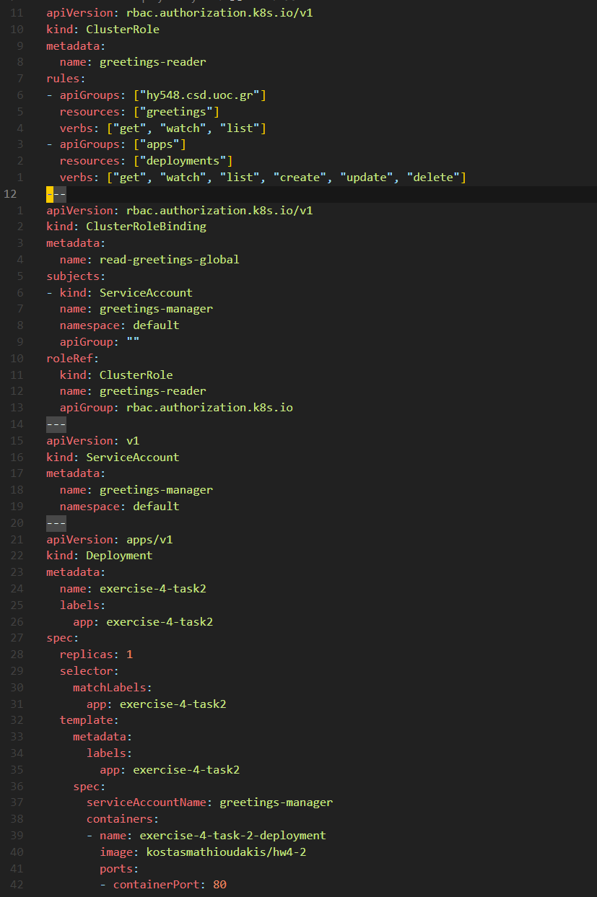

PS: i removed those permissions(rules) i am using in the screenshot and just used * because i couldnt find how to make it work otherwise.

Apply the greeting-crd and the deployment:

```bash
$  kubectl apply -f greeting-crd.yaml
$  kubectl apply -f exercise-4-task-2-deployment.yaml
```

Minikube dashboard logs:

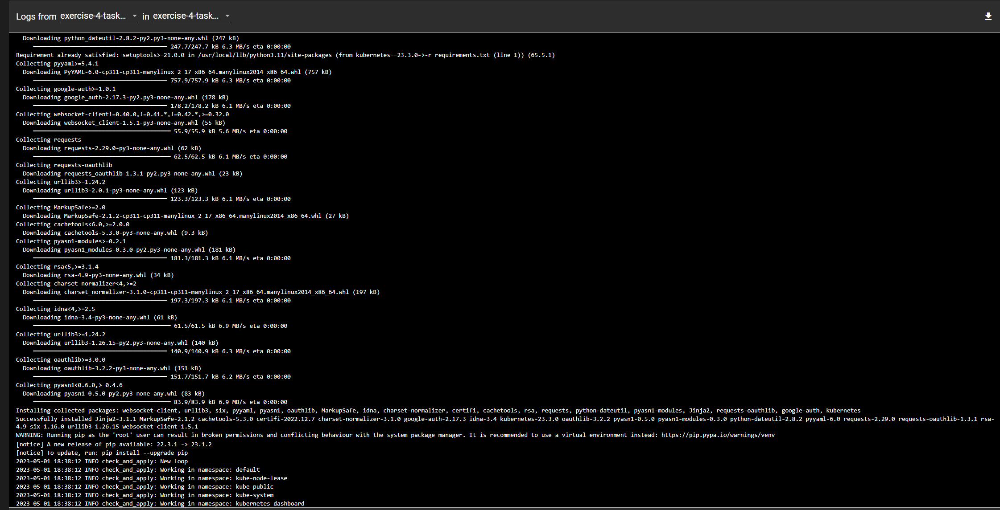

```bash
$ kubect apply hello-world.yaml
```

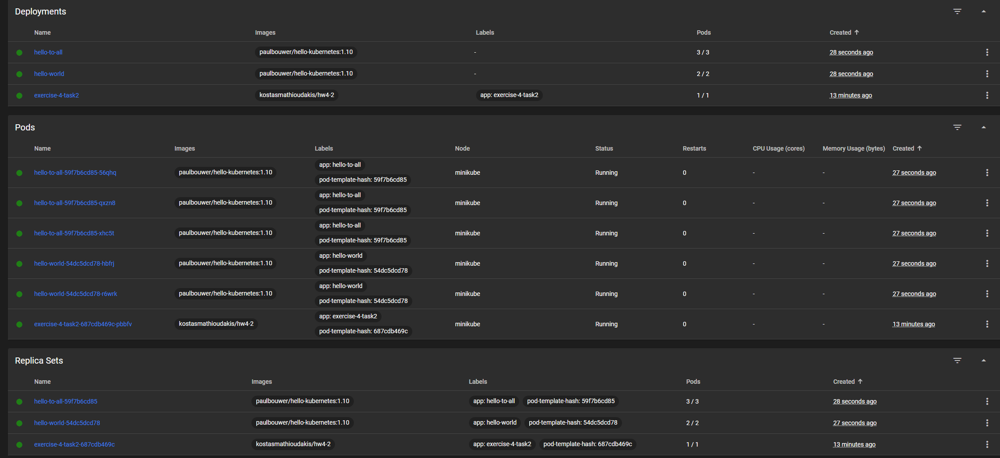

We can also use:

```bash
$ kubectl get services
$ kubectl logs {name}
```

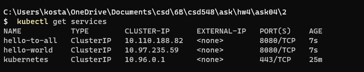

***

## Exercise 3

### a)

 - Removed the lines in the dockerfile for kubectl because they are not necessary for this.
 - Changed the controller app parameters.
 - Built and pushed to dockerhub.


`./3/Dockerfile`

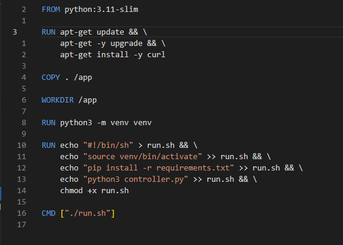

`./3/controller.py`

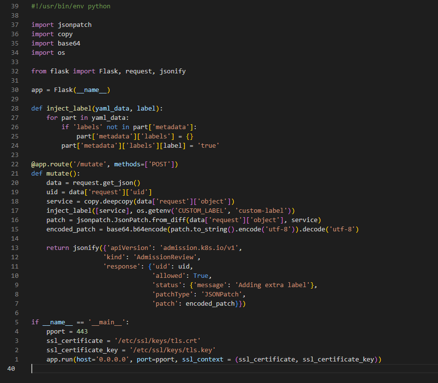

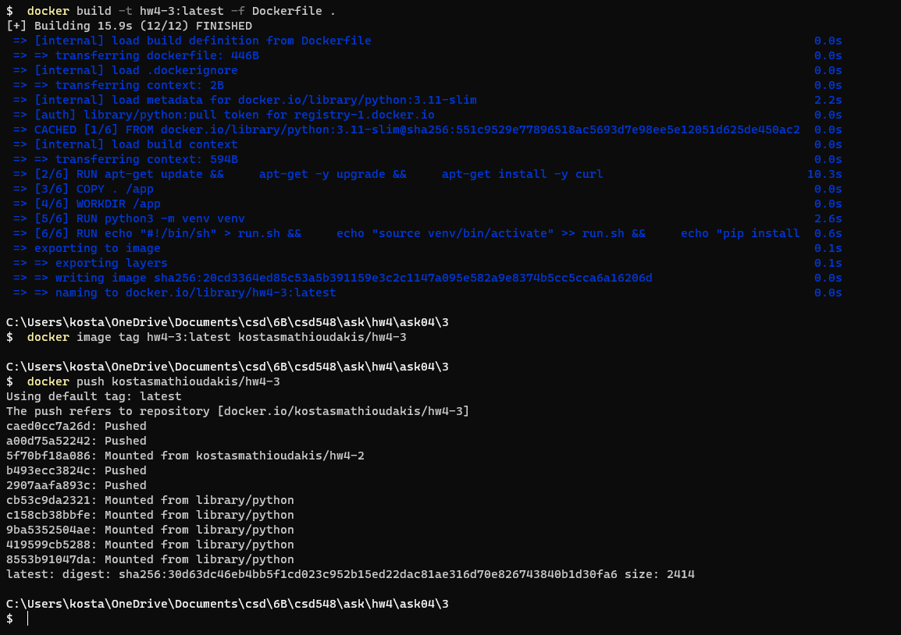

### b)

The demo pod yaml file is at `/3/demo-pod.yaml`:

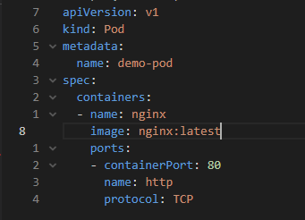

Made changes to the webhook to the proxy ip and to the container image.

`/3/webhook.yaml`:

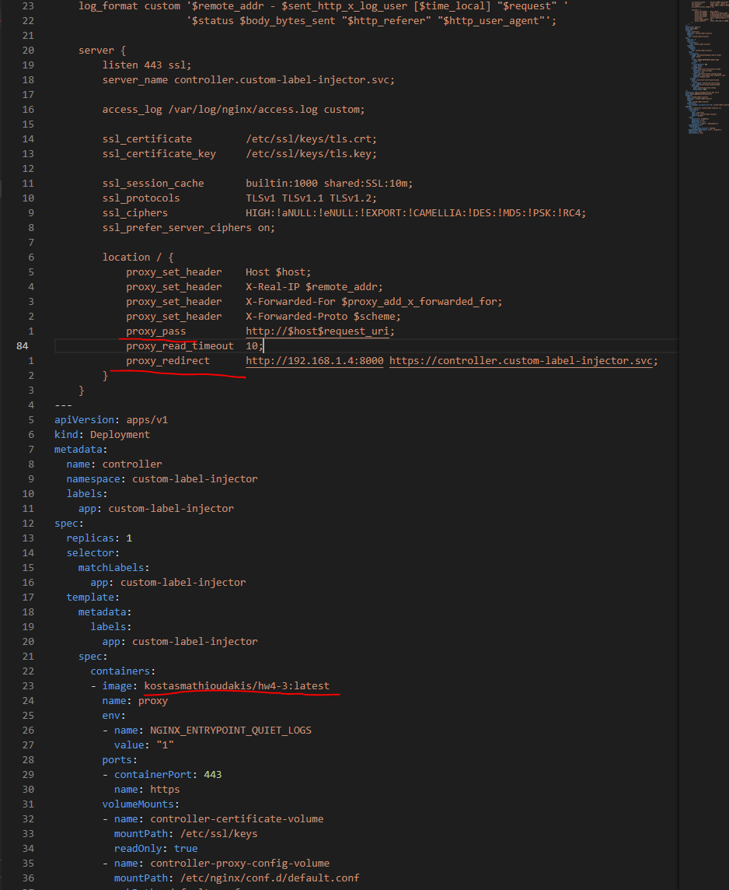

First add jetstack and install cert-manager:

```bash
$   helm repo add jetstack https://charts.jetstack.io

$   helm install cert-manager jetstack/cert-manager --namespace cert-manager --create-namespace --version v1.7.2 --set installCRDs=true
```

Then create the namespace, start the webhook and start the demo pods (one in the default namespace and one in the new `test` namespace ) to see if the custom label injection is working properly:

```bash

$   kubectl create namespace test
$   kubectl label namespace test custom-label-injector=enabled
$   kubectl apply -f webhook.yaml
$   kubectl apply -f demo-pod.yaml
$   kubectl apply -f demo-pod.yaml --namespace=test

```

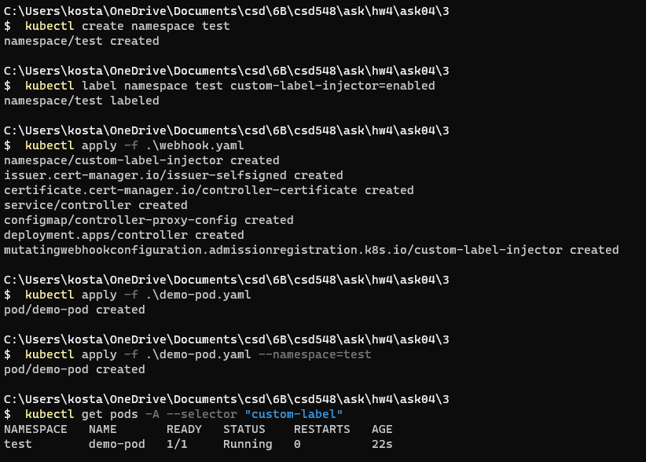

To test if it's working correctly:

```bash
$   kubectl get pods -A
$   kubectl get pods -A selector "custom-label"
$   kubectl logs deployment/controller -n custom-label-injector
$   kubectl get pods -A -o=custom-columns=NAMESPACE:.metadata.namespace,NAME:.metadata.name,LABELS:.metadata.labels
```

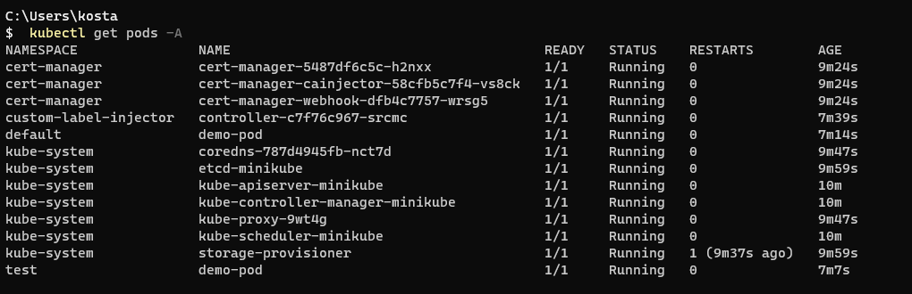

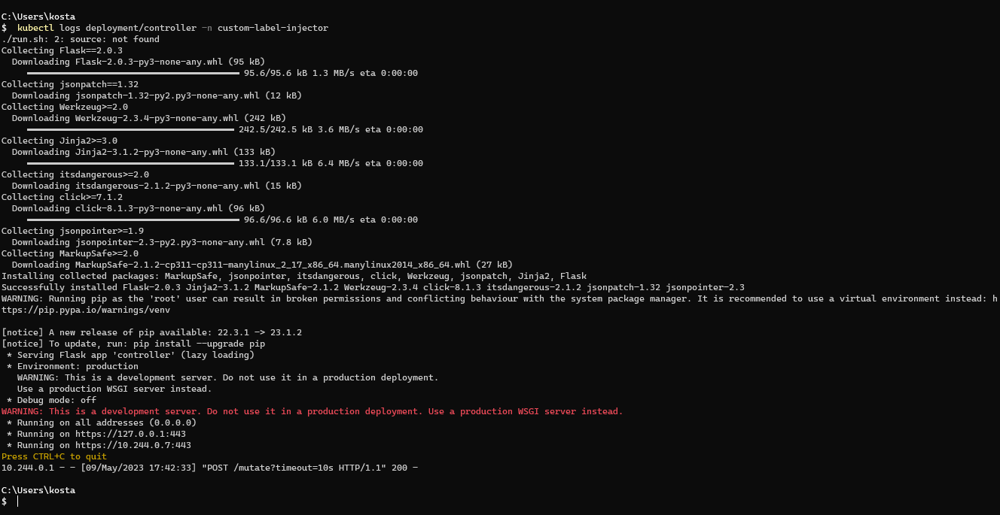

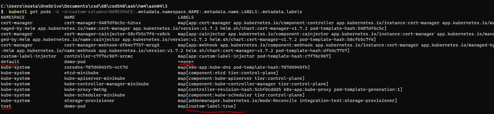
